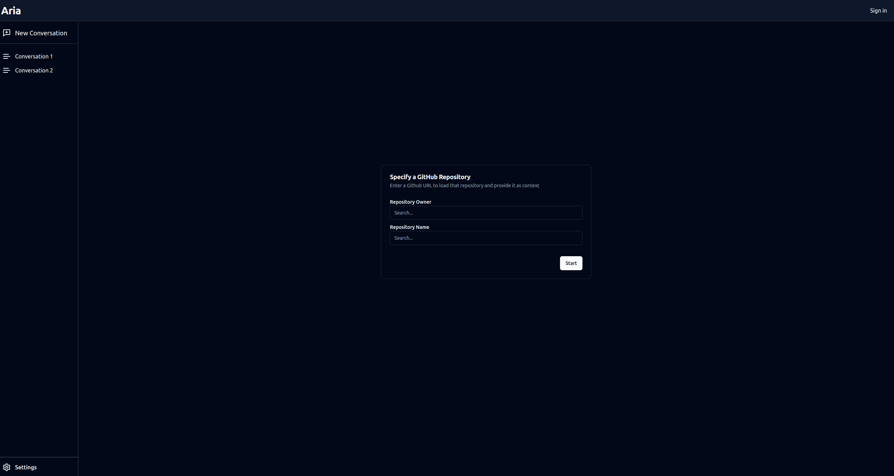
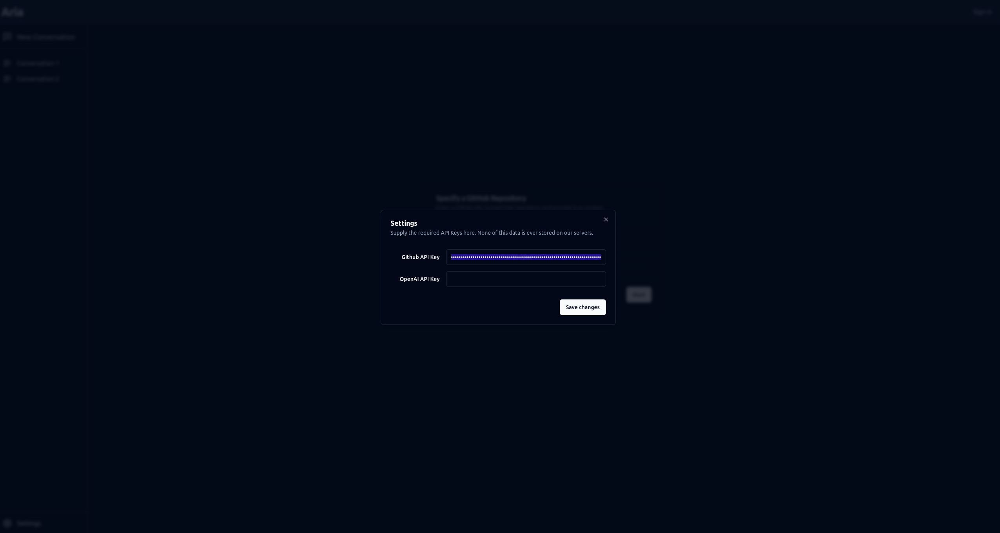

# Aria

Aria is a application that allows you to specify a github repo and use it as context to chat with an AI

## Techologies

### Frontend
- Sveltekit
- Typescript
- Shadcn
- Vite/Vitest
- Playwright

### Backend
- ASP.Net
- Sqlite
- NSwag

## Setup
This app uses a devcontainer, which is also used as a build environment. To setup, just open vscode and run 'With with devcontainer'. To build everything, from the root directory run `bash ./build.sh`.

To start the backend, navigate to `./src/backend/Aria.Server.TestServer` and run `dotnet run`. This will start the server using an in memory sqlite server for more convinient development.

To start the webserver in debug mode, open the 'client' workspace and run the 'Launch SvelteKit server' profile. 

To run the playwright tests on your host machine (not in the dev container) run `xhost +local`, without this you wont be able to view the playwright browser. To run the tests just run `pnpm test` or run using the vscode extension, which is included in the container.

## Screenshots

### Landing

### Sign up

### Login

### Home

### Settings
